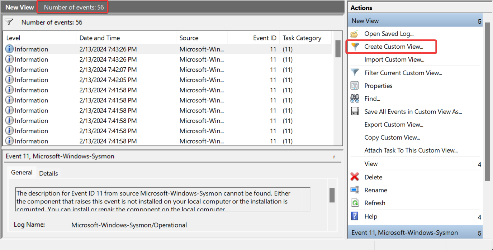
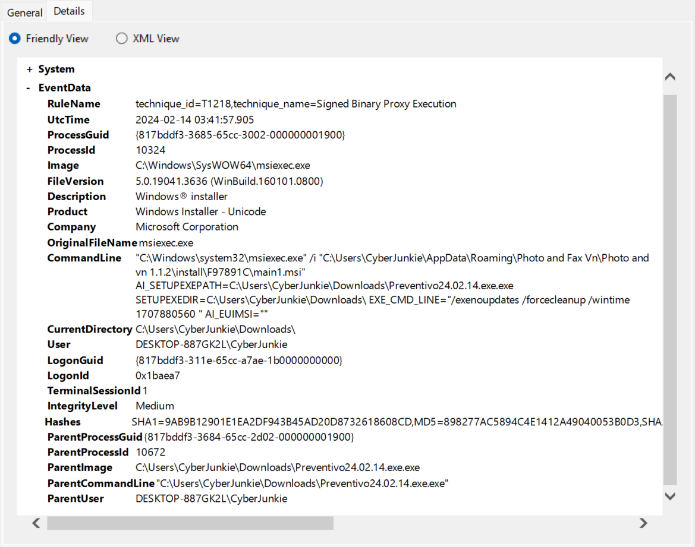
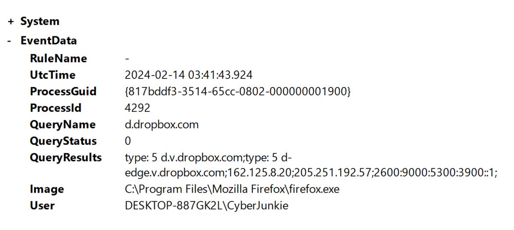
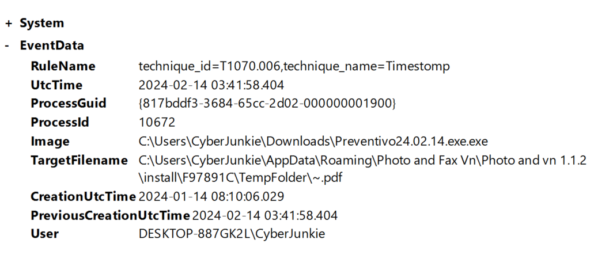
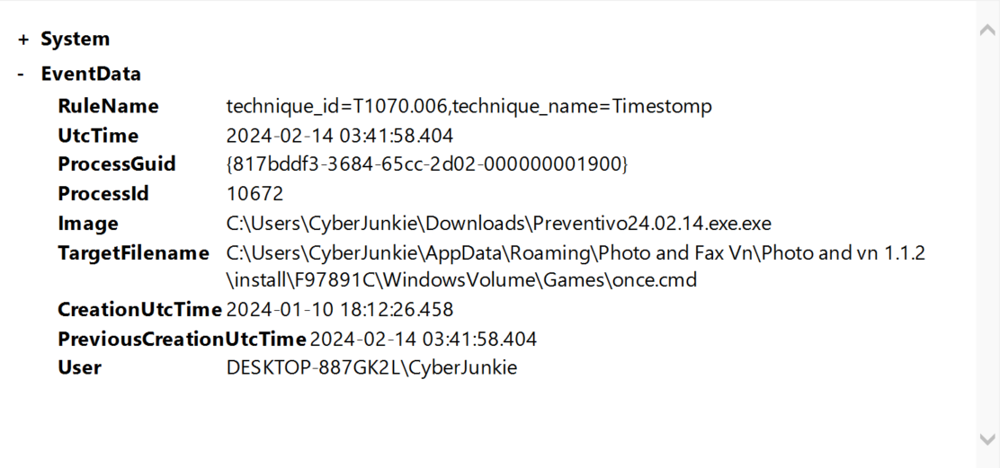
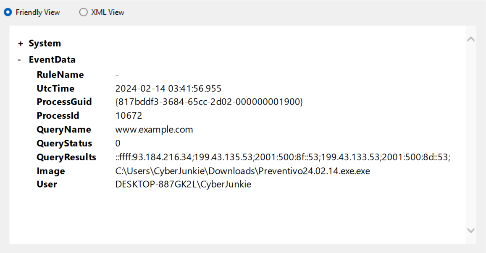
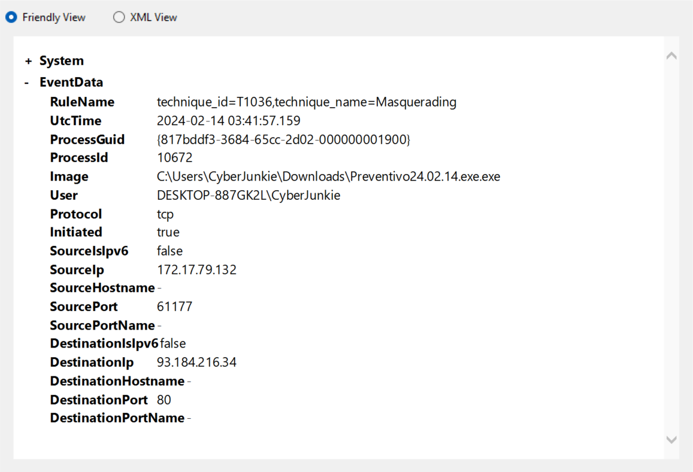
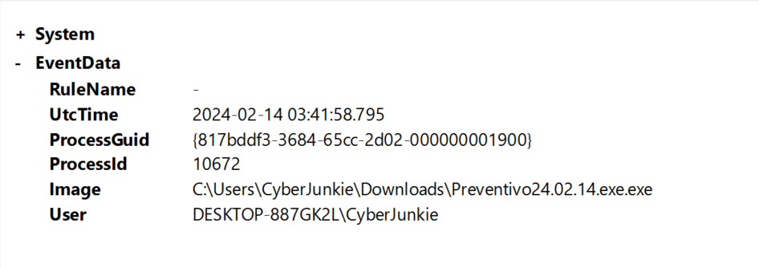

# Unit42

## Sherlock Scenario

In this Sherlock, you will familiarize yourself with Sysmon logs and various useful EventIDs for identifying and analyzing malicious activities on a Windows system.
Palo Alto's Unit42 recently conducted research on an UltraVNC campaign, wherein attackers utilized a backdoored version of UltraVNC to maintain access to systems. This lab is inspired by that campaign and guides participants through the initial access stage of the campaign.

---

通过监控系统活动 Sysmon 可以为用户提供详细的日志信息，并以事件的方式将它们完整记录到系统日志中。

Sysmon 的安装和配置：

```
Sysmon.exe -accepteula -i
Sysmon.exe -c --
```

使用 wevtutil 命令将 Sysmon 事件导出到 XML 文件，此文件稍后将由 Sysmon View 导入：

```
wevtutil query-events "Microsoft-Windows-Sysmon/Operational" /format:xml /e:sysmonview > eventlog.xml

wevtutil export-log Microsoft-Windows-Sysmon/Operational Sysmon.evtx
```


以下是 Sysmon 支持的事件类型：

| ID      | Tag                    | Event                                                        |
| :------ | :--------------------- | :----------------------------------------------------------- |
| **1**   | ProcessCreate          | Process Create                                               |
| **2**   | FileCreateTime         | File creation time                                           |
| **3**   | NetworkConnect         | Network connection detected                                  |
| **4**   | n/a                    | Sysmon service state change (cannot be filtered)             |
| **5**   | ProcessTerminate       | Process terminated                                           |
| **6**   | DriverLoad             | Driver Loaded                                                |
| **7**   | ImageLoad              | Image loaded                                                 |
| **8**   | CreateRemoteThread     | CreateRemoteThread detected                                  |
| **9**   | RawAccessRead          | RawAccessRead detected                                       |
| **10**  | ProcessAccess          | Process accessed                                             |
| **11**  | FileCreate             | File created                                                 |
| **12**  | RegistryEvent          | Registry object added or deleted                             |
| **13**  | RegistryEvent          | Registry value set                                           |
| **14**  | RegistryEvent          | Registry object renamed                                      |
| **15**  | FileCreateStreamHash   | File stream created                                          |
| **16**  | n/a                    | Sysmon configuration change (cannot be filtered)             |
| **17**  | PipeEvent              | Named pipe created                                           |
| **18**  | PipeEvent              | Named pipe connected                                         |
| **19**  | WmiEvent               | WMI filter                                                   |
| **20**  | WmiEvent               | WMI consumer                                                 |
| **21**  | WmiEvent               | WMI consumer filter                                          |
| **22**  | DNSQuery               | DNS query                                                    |
| **23**  | FileDelete             | File Delete archived                                         |
| **24**  | ClipboardChange        | New content in the clipboard                                 |
| **25**  | ProcessTampering       | Process image change                                         |
| **26**  | FileDeleteDetected     | File Delete logged                                           |
| **27**  | FileBlockExecutable    | File Block Executable                                        |
| **28**  | FileBlockShredding     | File Block Shredding                                         |
| **29**  | FileExecutableDetected | File Executable Detected                                     |
| **255** | Error                  | This event is generated when an error occurred within Sysmon. |

> from: https://learn.microsoft.com/en-us/sysinternals/downloads/sysmon#events

## Task 1

How many Event logs are there with Event ID 11?

---

创建自定义视图，筛选事件 ID 11：



Answer：56

## Task 2

Whenever a process is created in memory, an event with Event ID 1 is recorded with details such as command line, hashes, process path, parent process path, etc.  

This information is very useful for an analyst because it allows us to see all programs executed on a system, which means we can spot any malicious processes being executed. What is the malicious process that infected the victim's system?

---

通过进程事件（ID=1）可以查看监控期间启动的所有进程，包括进程路径、启动参数、父进程、文件 Hash 等信息。大多时候可以通过父进程逐级找到最初执行的恶意程序，并根据命令行参数找到恶意软件执行的命令。



可以看到 CommandLine 的值如下：

```
"C:\Windows\system32\msiexec.exe" /i "C:\Users\CyberJunkie\AppData\Roaming\Photo and Fax Vn\Photo and vn 1.1.2\install\F97891C\main1.msi" AI_SETUPEXEPATH=C:\Users\CyberJunkie\Downloads\Preventivo24.02.14.exe.exe SETUPEXEDIR=C:\Users\CyberJunkie\Downloads\ EXE_CMD_LINE="/exenoupdates /forcecleanup /wintime 1707880560 " AI_EUIMSI=""
```

答案：`C:\Users\CyberJunkie\Downloads\Preventivo24.02.14.exe.exe`

## Task 3

Which Cloud drive was used to distribute the malware?

---

筛选 DNS (DNS query) 事件（ID=22）



Answer：`dropbox`


## Task 4

The initial malicious file time-stamped (a defense evasion technique, where the file creation date is changed to make it appear old) many files it created on disk. What was the timestamp changed to for a PDF file?

---

筛选文件创建时间修改事件（ID=2）



Answer: `2024-01-14 08:10:06`


## Task 5

The malicious file dropped a few files on disk. Where was "once.cmd" created on disk? Please answer with the full path along with the filename.

---

筛选文件创建时间修改事件（ID=2）



Answer: `C:\Users\CyberJunkie\AppData\Roaming\Photo and Fax Vn\Photo and vn  1.1.2\install\F97891C\WindowsVolume\Games\once.cmd`


## Task 6

The malicious file attempted to reach a dummy domain, most likely to check the internet connection status. What domain name did it try to connect to?

---

DNS




## Task 7

Which IP address did the malicious process try to reach out to?

---

筛选网络连接事件（Event ID=3）




## Task 8

The malicious process terminated itself after infecting the PC with a backdoored variant of UltraVNC. When did the process terminate itself?

---

筛选进程终止事件（Event ID=5）




答案：`2024-02-14 03:41:58`